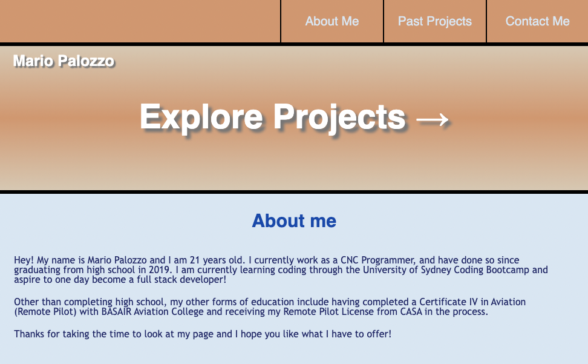
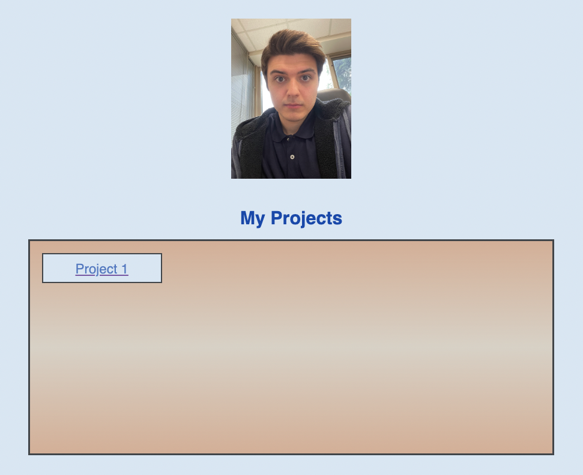
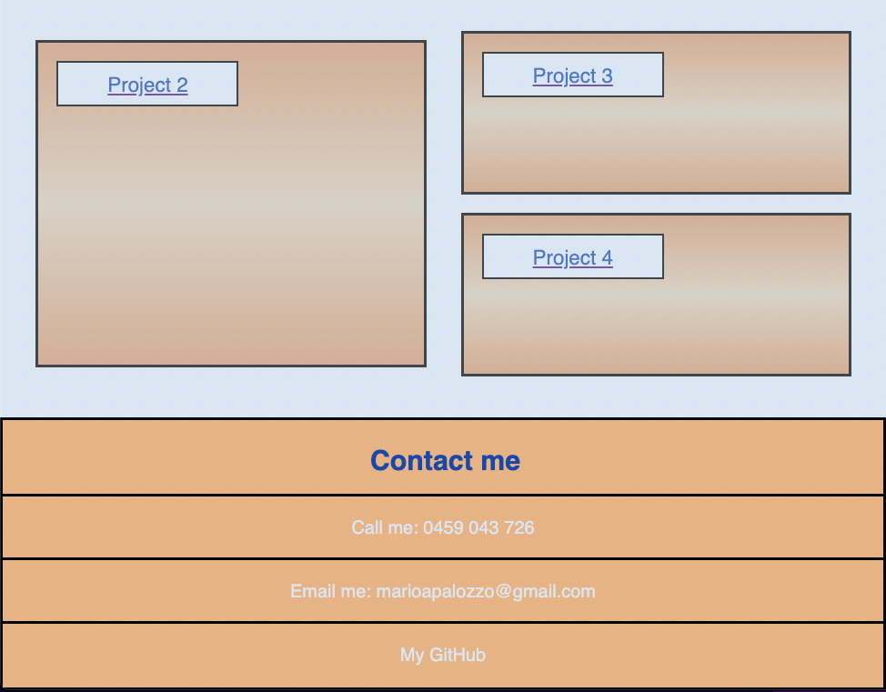

# My Portfolio - Mario Palozzo

## Description

I created this portfolio so that I could show my completed projects and different forms of experience in coding to employers, giving them ways of contacting me for potential work if they wish to do so. It is laid out in a way that systematically and efficiently displays different projects that I have completed along with other information about me. It is aimed at being accessible to users of different types of devices, all the while showing off my skills as a programmer through its design.

While serving a clear fundamental purpose, the experience of creating this project was also beneficial to me. Through the practical application of more advanced forms of CSS that I haven't used before, I became more knowledgeable in being able to use these in order to create an accessible and visually appealing webpage.

 

## Usage

The user is able to interact with the webpage in a number of ways, these include:

- The links at the top navigation bar taking the user to the section of the page they wish to see.
- Clickable links that allow the user to view my GitHub page, call or email me for any inquiries they may have.
- As projects are added in the future, the user will be able to click on whichever one they want to view and be redirected to it. However, for now, the links direct the user back to the page they are already on.

 

Link to access the page:

https://flabber459.github.io/Week2-Challenge-MP/

 

